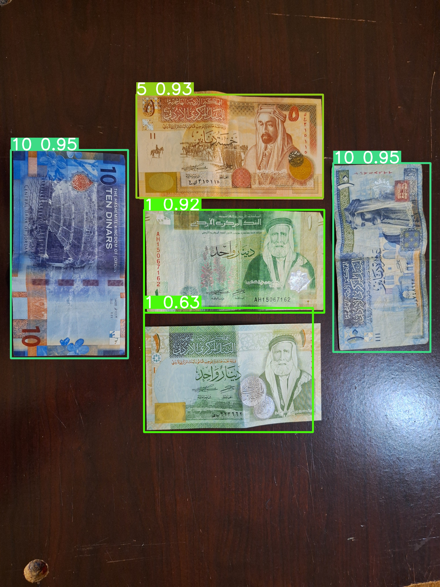
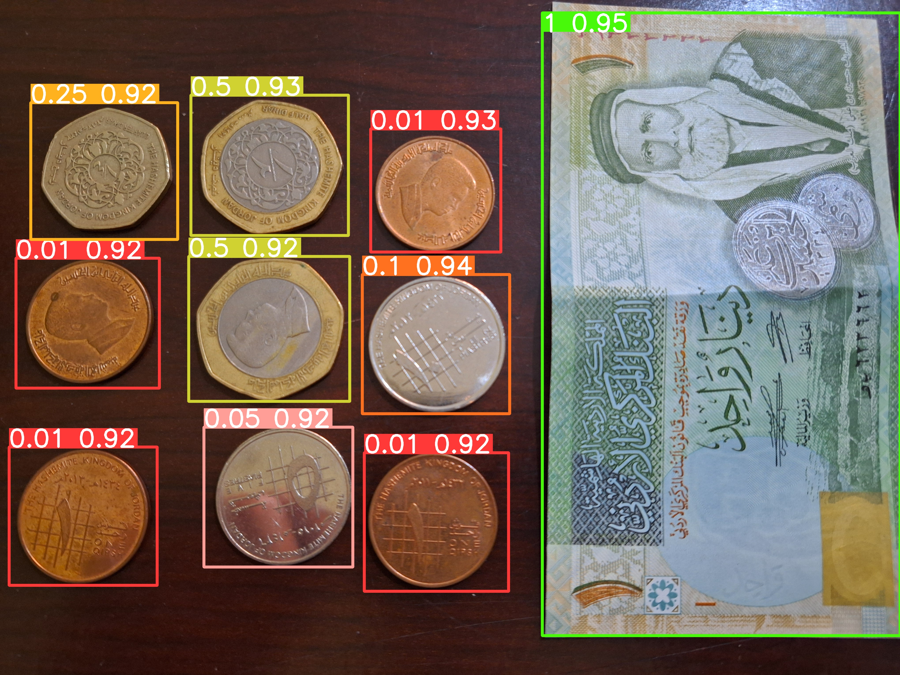
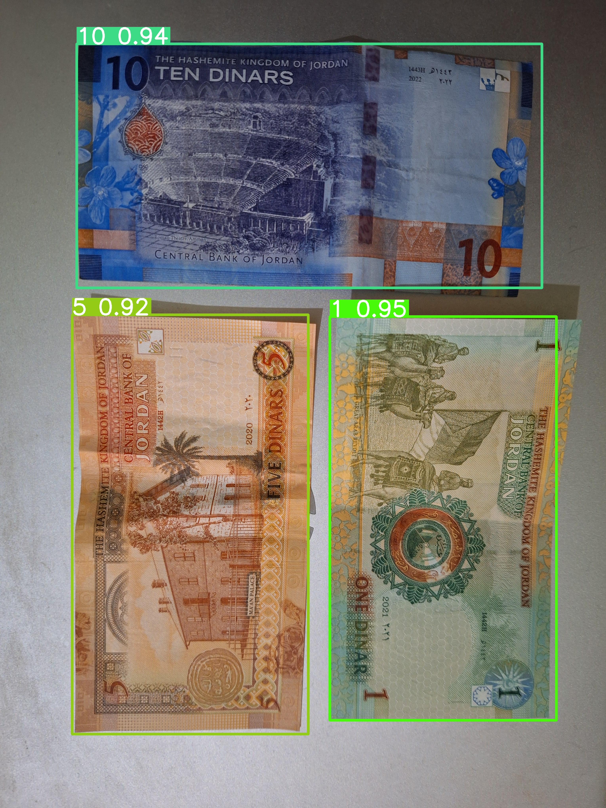

# Jordanian-Currency-Detection

Explore the Jordanian-Currency-Detection web application by visiting the following link: [Jordanian-Currency App.](https://jordanian-currency-ahmad.streamlit.app/)

## Overview

This project tackles the **object detection** problem of identifying Jordanian currency in images. We built a custom dataset by collecting images ourselves and enhanced the dataset using **image augmentation techniques** such as **rotation** and **brightness adjustment** to increase its size and diversity.

We trained the model using the **YOLO (You Only Look Once)** architecture, which is well-suited for real-time object detection tasks.

## Example Predictions

Here are some example outputs from our trained model:

  
  
   
  

